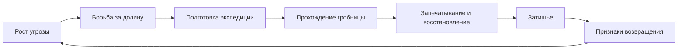

# originator: от проверяемых площадок к миру приключения

Дата: 2026-09-06. Статус: согласованное направление и предлагаемый порядок проверки.

Документ собирает обсуждение автора и агента: конечную цель, форму генерируемого мира,
библиотеки дизайнерских заготовок, цикл событий и последовательность площадок, которые должны
проверить недостающие механизмы. Это план исследования и реализации, а не описание уже готовой системы.

Связанные документы:

- [originator: устройство и существующие инструменты](libs/originator/README.md);
- [GPGPU: решения, ограничения и история замеров](ORIGINATOR_GPGPU.md);
- [общий roadmap движка](ROADMAP_ULT.md), особенно «Generator contract», «World residency and artifact
  pipeline», «Physics», «Navigation» и «Networking»;
- [существующие площадки](subprojects/playgrounds/README.md).

У исторических документов статус местами отстаёт от реализации. Например, начало GPGPU-документа
ещё описывает только CPU-очередь, а в общем roadmap генераторный хост назван отсутствующим.
Для наличия механизма источником истины остаётся код. Здесь отдельно отмечены существующий задел,
предлагаемая работа и открытые вопросы; проценты готовности и сроки разработки не оцениваются.

## 1. Ультимативная цель

Получить конечный процедурный мир для кооперативного приключения:

- несколько биомов, узнаваемая география, поселения, руины, пещеры и ресурсы;
- разнообразие исследования, ради которого интересен Minecraft, при почти статичной геометрии;
- простые физические и пространственные головоломки как приятные отступления от основной игры:
  небольшой набор повторяемых паттернов в разнообразных, естественных для них местах, ближе к
  выбранному автором ориентиру Genshin Impact, чем к автоматическому сочинению сложных комнат Zelda;
- общий сюжет, который ощущается через происходящее вокруг: связанные события меняют жизнь карты,
  игрок помогает местным и постепенно вовлекается без обязательной цепочки диалогов;
- редкий большой цикл победы, восстановления, затишья и возвращения угрозы, по духу выбранного
  автором примера The Silverwastes, но на большем пространстве и с более долгим развитием;
- ориентир на пару десятков часов освоения мира. Это дизайнерское пожелание, не измеренный объём
  готового содержания и не обещание длительности одной экспедиции или одного цикла.

**«Нечанковый» определён однозначно:** генератор за один полный запуск создаёт весь пакет мира,
сохраняет его на диск, после чего игра переиспользует результат. Это модель GN02. Внутри запуска
могут быть многие шаги, масштабы и рабочие блоки; готовые данные можно нарезать для загрузки частями.
Результат не достраивается независимой генерацией вокруг каждого игрока.

**Изменяемость ограничена:** свободного копания и строительства как в Minecraft в текущей цели нет.
Мир меняется по предусмотренным правилам: восстановление аванпоста, открытие прохода, разрушение
моста, смена населения, закрытие гробницы. Для этих изменений можно заранее готовить локальные
варианты геометрии, коллизий и навигационных связей.

**Размер не закреплён.** 5×5 км — первоначальный ориентир, взятый с потолка. Реальная площадь должна
следовать из перемещения, плотности интересного, числа мест и ритма приключения. Генерация может
идти фоном на машине игрока или на отдельном сервере с последующей передачей пакета.

## 2. Опорный пример: долина и гробница

В центре карты находится гробница — источник тёмной магии. Мёртвые восстают на кладбищах,
нападают на людей и нарушают снабжение. Игрок встречает последствия: пустеющие дороги, нападения,
разорённые хозяйства, просьбы о помощи в самой сцене. Помогая местным, он восстанавливает деревни
и аванпосты, обеспечивает маршруты и продвигается к источнику угрозы.

После прохождения гробница закрывается на некоторое время, группа получает большую награду.
Мир становится безопаснее и населённее. Позднее появляются признаки возвращения угрозы; если их
оставлять без внимания, мир постепенно откатывается. Это может происходить и пока игроки находятся
в другом мире.

Это **референсная ситуация для первых площадок**, а не обязательная тема всех будущих миров.
Следующие темы должны заменять содержание через шаблоны и правила проекта.



Это схема общего цикла. Состояния мест меняются отдельно: одна деревня уже торгует, другую
восстанавливают, третья отражает нападение. Общая фаза не должна одновременно перекрашивать все
поселения или заменять их собственную историю.

Предложения, которые ещё требуют игровой проверки:

- затишье открывает собственные занятия: исследование прежде опасных мест, восстановление,
  новые торговцы, секреты и небольшие экспедиции;
- повторные циклы сохраняют часть следов прошлой победы: архитектуру, открытые пути или другие
  устойчивые изменения. Что именно сохраняется, автор ещё не определил;
- возвращение угрозы имеет наблюдаемые причины и предвестники. Скорость упадка и допустимая потеря
  прогресса должны помогать повторному приключению, а не превращать отсутствие игрока в обязанность
  постоянно обслуживать мир.

## 3. Что именно создаёт генератор

Результат — **география + места с ролями + экземпляры событий + предусмотренные состояния +
артефакты для игры**. Одних полей высоты, биомов и набора случайных точек недостаточно.

### 3.1 Места и отношения

У мест есть стабильные идентификаторы. Между ними существуют разные отношения:

| Отношение | Пример | Что проверяется |
|---|---|---|
| Пространственное | Дорога и обход между деревней и аванпостом | Проходимость, длина пути, нужные способности |
| Причинное | Захваченный аванпост повышает опасность дороги | Явные условия и последствия |
| Хозяйственное | Деревня снабжает аванпост | Источник, получатель и существующий маршрут |
| Сценарное | Защита маршрута позволяет готовить экспедицию | Достижимость продвижения, отсутствие тупиков |

Один нетипизированный граф не должен смешивать эти значения. Для начала достаточно проектных
записей с общими id и типизированными связями; универсальная графовая библиотека заранее не нужна.
Граф зависимости шагов генерации и циклический граф жизни мира — разные структуры.

Событие появляется из условий мира: есть готовый обоз и нуждающийся получатель — возможно
сопровождение; кладбище усилилось — возможно нападение. Физически значимые события должны иметь
место, маршрут и участников, а не существовать только в списке заданий.

### 3.2 Экземпляры событий вместо обязательной генерации исходников

Первый вариант генератора **собирает экземпляры проверенных сценариев**, связывает их id мест,
назначает параметры и последствия. Писать отдельный Lua/ds-текст для каждого обоза не требуется.

```text
тип: сопровождение снабжения
источник: деревня_12
получатель: аванпост_4
маршрут: дорога_7
условия: источник населён, получатель нуждается в припасах
успех: увеличить снабжение получателя
поражение: потерять обоз, разрешить поиск выживших
```

Тип сценария определяет условия запуска, ход события, успех, поражение, прерывание, освобождение
занятых ролей и возможность повторения. Экземпляр содержит конкретные привязки и сохраняемое
состояние. Соседние события должны иметь правила совместного использования места, маршрута и NPC.

Существующие act/ds/FSM-механизмы рассматриваются как задел для исполнения, а не как уже готовый
общемировой хозяин событий. Генерация новых выражений или компиляция составленной логики остаётся
возможным расширением, если экземпляров и композиции готовых действий окажется недостаточно.

### 3.3 Направление генерации

```text
ситуация мира + набор способностей + бюджеты
  -> роли мест и отношения между ними
  -> грубая география, области и маршруты
  -> назначение событий местам, согласование ограничений
  -> размещение заготовок и резервирование пространства
  -> рельеф, полости, модули, обязательные объекты
  -> головоломки, окружение и детали
  -> геометрия, коллизии, навигация, представление состояний
  -> обратная проверка от реальной геометрии к условиям приключения
  -> ограниченная коррекция или объяснимый отказ
  -> запечатанный пакет мира
```

Это несколько уточнений замысла. География тоже ограничивает возможные события; допустим возврат
к размещению или выбору модуля с ограниченным числом попыток. Все исправления называют причину,
изменённые записи и зависимые результаты, которые нужно пересчитать.

Базовые проходы рельефа могут предшествовать размещению, но окончательная детализация обязана
уважать нужные игре коридоры, площадки, точки взаимодействия и обзор. Например, поздно добавленная
скала не должна засыпать вход в уже проверенную комнату.

## 4. Библиотеки заготовок и их склейка

Нужны две связанные библиотеки, принадлежащие проекту.

**Игровые ситуации:** переместить груз, направить поток воды, открыть проход механизмом, пройти
короткую последовательность платформ, сопроводить обоз, восстановить объект, оборонять место.

**Дизайнерские композиции:** комната, лестница, вход в руины, скальный навес, терраса, двор,
группа валунов, кладбище, участок поселения. Композиция может быть готовым модулем или рецептом
«как расположить элементы», а не только мешем.

### 4.1 Минимальный контракт пространственной заготовки

| Объявление | Смысл |
|---|---|
| Локальная система координат и допустимые преобразования | Как размещать и варьировать, не ломая функцию |
| Порты входа/выхода | Положение, направление, размеры, тип прохода, требования к стыку |
| Именованные места объектов | Рычаг, награда, противник, опора, источник воды, точка события |
| Занятые объёмы и опоры | Где материал, чем поддержана конструкция, где запрещены пересечения |
| Объёмы добавления и вырезания | Как заготовка изменяет окружающую породу |
| Защищённое свободное пространство | Проход, место взаимодействия, траектория, обзор, пространство камеры |
| Требования к окружению | Уклон, биом, поверхность, вода, высота, соседние роли |
| Локальные состояния | Закрыто/открыто, разрушено/восстановлено и изменяемые части |
| Проверки и происхождение | Почему подходит, от какого шаблона получена, что разрешено исправить |

Размер порта и форма опоры — данные, а не соглашение в имени меша. Масштабирование ограничивается
шаблоном: произвольное растяжение способно превратить доступный прыжок в невозможный.

Пример склейки: игровой шаблон просит вход, место груза, цель и награду. Пространственная заготовка
предоставляет подходящие места и свободный путь между ними. Встроенная в скалу композиция сохраняет
те же роли после запекания. Отсутствие подходящего места означает отказ размещения или другую
заготовку, а не молчаливый пропуск обязательного объекта.

Текущий [prefab_registry](libs/prefab/include/devils_engine/prefab/prefab_registry.h) собирает
сущности из компонентов. Он может создавать объекты заготовки, но сам не решает пространственную
укладку, вырезание породы и проверку портов.

### 4.2 Вырезание комнаты и размещение скал

Для комнаты в скале первый полный путь такой:

1. Выбрать место, согласовать вход с маршрутом, проверить запас материала вокруг полости.
2. Зарезервировать комнату, коридор и пространство игровых действий.
3. Вырезать полость в поле плотности и подготовить входной переход.
4. Установить пол, архитектурные элементы, механизмы и обязательные объекты.
5. Оформить стык скалами и деталями, сохраняя зарезервированное пространство.
6. Извлечь поверхность, подготовить коллизии/навигацию и проверить фактический путь игрока.

Поля подходят для земли, скал, полостей и плавных переходов. Модули подходят для точных лестниц,
дверей и механизмов. Не требуется превращать все авторские меши в единое плотное поле всего мира.
Булевы операции над произвольными треугольными мешами тоже не являются обязательным первым шагом.

У рецепта группы скал свой порядок: крупные массы -> опора и ориентация -> дополнительные массы ->
мелкие детали -> проверка силуэта, пересечений и свободных проходов.

Локальные варианты изменений запекаются по месту. Комбинация состояний десяти деревень не должна
порождать отдельную полную копию карты для каждой комбинации. Смена состояния согласованно меняет
видимые объекты, коллизии, навигационные связи и точки событий.

### 4.3 Вариативность головоломок

Варьируются окружение, взаимное положение частей, способ обнаружения, подсказка, путь доступа,
доступность нужного предмета и небольшое усложнение решения. Одна смена оформления даёт визуальную
вариацию, но не новое решение; обе величины нужно учитывать отдельно.

Шаблон описывает условия естественности: водяной механизм требует источника воды, подъёмник —
перепада высоты, погребальная композиция — соответствующего места. Случайный выбор учитывает уже
поставленные паттерны, их соседство и вероятные маршруты, чтобы не выдавать подряд одно и то же.

Головоломки факультативны относительно основного продвижения, если автор явно не назначил другую
роль. Требования по числу игроков, восстановлению потерянного предмета и сбросу незавершённого
испытания объявляются шаблоном. Проверка примера решения необходима, но не доказывает невозможность
любого обхода или удовольствие от задачи.

## 5. Пакет мира и его последующая жизнь

### 5.1 Три разных результата

| Результат | Что содержит | Кто меняет |
|---|---|---|
| Определение генератора | Скрипты, инструменты, шаблоны, параметры и зависимости | Автор проекта/модов |
| Запечатанный пакет мира | Полученные места, связи, геометрия, привязки событий, варианты и ссылки на артефакты | Генератор до публикации |
| Состояние экземпляра мира | Фазы, население, снабжение, последствия действий, активные события и часы | Игровая симуляция |

Пакет включает версию схемы, происхождение генерации, seed, параметры, версии/отпечатки зависимостей,
описание пути CPU/GPU, стабильные id и хеши содержимого. Отладочные сведения о выборе шаблонов,
отказах и исправлениях можно хранить отдельной секцией или сопутствующим отчётом.

Хеш конкретных байтов определяет полученный артефакт. Один seed и даже одинаковый выбор GPU-пути
не обещают побитово одинаковый результат на разных драйверах. При серверной генерации клиенты
получают уже проверенные байты общей геометрии, коллизий и прочих причин игровой проходимости.
Это снимает необходимость независимо воспроизводить GPU-генерацию на клиенте, но само по себе
не решает сетевую синхронизацию последующей симуляции.

Загрузка не обязана держать весь пакет в памяти. Индекс частей и зависимости артефактов позволяют
подгружать области; технические границы не меняют смысл мест, id событий или результат генерации.
Грубая карта и локальные объёмы могут иметь разное разрешение уже во время полного запуска.

### 5.2 Сохранение и фоновое развитие

Сохранение ссылается на точный пакет и содержит все причины следующего изменения: локальные и
общие состояния, активные события, причинные счётчики/PRNG, необходимые очереди и полное состояние
времени. Имеющиеся [serialization](libs/utils/include/devils_engine/utils/serialization.h),
[state_schema](libs/utils/include/devils_engine/utils/state_schema.h) и
[timeline](libs/utils/include/devils_engine/utils/timeline.h) — основа, а не повод заводить второй
байтовый кодек или отдельные несогласованные часы в каждом событии.

Для выгруженных мест возможна грубая модель: состояния поселений, угроза, снабжение и запланированные
переходы. Нет необходимости постоянно двигать по физике каждого отсутствующего в памяти скелета.
Материализация создаёт локальную сцену из авторитетного состояния; результаты локальной игры
возвращаются в него через определённые переходы.

Пока не выбрано, как считать время полностью выключенного мира: реальные часы, только часы
активной игры, ограниченное догоняющее развитие или другой режим. Механизм должен поддержать
выбранный контракт, но не выбирать дизайнерскую политику молча.

Выгрузка области сама по себе не останавливает событие и не меняет его исход. Переход между грубой
и подробной моделью требует правила передачи владения и обработки уже активных событий. Равенство
проверяется для объявленных причинных переходов, а не обещается для неисполненной физики NPC.

## 6. Исходная база и пробел до цели

| Задел | Уже даёт | Чего этим ещё не доказано |
|---|---|---|
| [GN01](subprojects/playgrounds/GN01_generator_contract/README.md) | Контракт генератора, поля, конфиг, воспроизводимость | Играбельная композиция мира |
| [GN02](subprojects/playgrounds/GN02_planet_generator/README.md) | Генерация целой планеты, графы, иерархия областей | Связанный с местами цикл событий |
| [GN03](subprojects/playgrounds/GN03_streaming_volume/README.md) | Объём, поверхность, общий каркас маршрутов, сохранённый каркас, загрузка частей | Контракт дизайнерских заготовок и полный игровой пакет |
| [GN04](subprojects/playgrounds/GN04_texture_generation/README.md) | Очередь для GPU и остающаяся на устройстве текстура | Полная генерация приключения на GPU |
| [GN05](subprojects/playgrounds/GN05_constraint_collapse/README.md) | Локальные ограничения и раскладка по правилам | Глобальная проходимость, решение головоломки, интересность |
| originator | Поля, CSR, инструменты, Lua/ds, CPU/GPU-очереди, профиль | Хозяин событий, физика, навигация и схема мира проекта |
| prefab / act / mood | Сборка сущностей и основы действий/состояний | Готовая система пространственных модулей и общей истории |
| utils / network | Кодеки, композиция состояния, основы сессии и восстановления | Реальная передача нового пакета и кооператив на этой карте |

На момент исходного обзора свежая Debug-сборка дала 145/145 тестов originator. Vulkan-устройство
в среде обзора отсутствовало, аппаратные сравнения были пропущены. Это историческая отметка
проверки, не подтверждение будущих площадок и не замена повторным аппаратным измерениям.

Физический контроллер персонажа, подготовка коллизий и навигация — внешние по отношению к originator
зависимости. Их пригодность для нужного 3D-сценария предстоит проверить. Они не считаются готовыми
только потому, что уже есть поверхность marching cubes или камера свободного полёта.

## 7. Последовательность проверяемых площадок

Имена GN06–GN13 ниже **предлагаемые**, каталогов и целей сборки пока нет. Каждая площадка добавляет
один основной проверяемый переход и переиспользует предыдущий результат. Общие наработки можно
вынести в код кампании; копирование восьми отдельных реализаций мира не является целью.

Первые конфиги намеренно малы. Указанные количества мест — предлагаемый объём первого опыта,
не измеренная достаточность содержания или оценка производительности.

| Порядок | Площадка | Главный вопрос | Результат для следующей |
|---|---|---|---|
| 1 | GN06_event_world | Получается ли связанная история без готовой геометрии? | Мир мест/событий и проверяемый цикл |
| 2 | GN07_spatial_templates | Как заготовки находят место и стыкуются? | Размещённые модули, порты, роли и резервы |
| 3 | GN08_terrain_embedding | Сохраняется ли замысел после встраивания в рельеф? | Проходимое место с комнатой в скале |
| 4 | GN09_puzzle_population | Можно ли разнообразить простые задачи и естественно их разместить? | Набор сыгранных и проверенных паттернов |
| 5 | GN10_world_package | Получается ли целый мир загрузить без генератора? | Полный пакет небольшой долины |
| 6 | GN11_persistent_world | Продолжается ли тот же мир после сохранения, выгрузки и отсутствия? | Сохраняемый цикл и грубая фоновая модель |
| 7 | GN12_coop_world | Видят ли участники один мир и одни последствия? | Кооператив, доставка пакета, поздний вход |
| 8 | GN13_world_scale | Выдерживает ли конструкция нужный размер и длительность игры? | Измеренный профиль и проверенная насыщенность |

```text
GN06 -> GN07 -> GN08 -> GN09 -> GN10 -> GN11 -> GN12 -> GN13
                      ^                         ^
           физика/навигация как зависимости    сеть/сессии

GPGPU: поперечная работа по измеренным цепочкам любой из площадок
```

### GN06_event_world — ситуация, места и цикл событий

**Опыт.** Схематичная долина: гробница, два поселения, аванпост и источники локальной угрозы.
Сначала один ручной эталон правил, затем несколько вариантов графа из тех же шаблонов. Карта 2D
или простые блоки; действия игрока можно подавать командами тестового хоста.

**Не хватает.** Проектных записей мест и отношений, типов и экземпляров событий, владельца состояния,
условий/переходов, ограничений одновременных событий и инспектора причин. Сериализуемый документ
этого маленького мира нужен уже здесь; полный формат геометрического пакета появится позднее.

**Проверки завершения:**

- В вариантах графа все обязательные роли назначены, ссылки разрешены, экспедиция достижима при
  заявленных успехах; отказ генерации на несовместимом варианте объясняет препятствие.
- Есть записанные сценарии помощи, бездействия и поражения. Они приводят к ожидаемым состояниям,
  позволяют пройти полный цикл и начать следующий без накопления старых участников/событий.
- Повтор одинаковых входов в фиксированном профиле исполнения даёт то же причинное состояние.
- Конфликтующие события не забирают один ресурс одновременно без объявленного правила.
- Условие продвижения не требует результата, который возможно получить только после него самого.

**Видно человеку.** Кто сейчас действует, почему возникло событие, что изменит успех/поражение;
несколько мест живут одновременно, а не ждут единственной линейной цепочки.

**Граница.** Не доказывает проходимость мест или интерес боевой игры. Следующий шаг — GN07.

### GN07_spatial_templates — заготовки, порты и защищённое пространство

**Опыт.** Комната, вход, коридор, площадка аванпоста и рецепт группы скал собираются из простых
мешей. Роли GN06 назначаются этим заготовкам. Варианты размера и ориентации ограничены контрактом.

**Не хватает.** Описания заготовки, согласования портов, размещения по кандидатам, проверки опор и
пересечений, пространственных резервов и ограниченного повторного выбора. Физический размер
персонажа и базовые способы движения задаются тестовым профилем, явно временным до решения автора.

**Проверки завершения:**

- Порты совпадают по геометрии и смыслу, обязательные места объектов заполнены.
- Заготовки имеют нужные опоры, не пересекают запрещённые объёмы и не перекрывают проходы.
- Проверка против простого полного перебора на малой сцене подтверждает работу ускоренных запросов.
- Невозможная укладка заканчивается за объявленное число попыток с конкретной причиной.
- Происхождение каждого объекта позволяет восстановить шаблон, преобразование и причину выбора.

**Видно человеку.** Наложения портов, опор, занятых и свободных объёмов; одна заготовка в нескольких
окружениях. Проверяется ясность входов и общая композиция.

**Граница.** Блочная проходимость ещё не доказывает проходимость после рельефа. Следующий шаг — GN08.

### GN08_terrain_embedding — комната в скале и готовая поверхность

**Опыт.** Встроить одну комнату с входным коридором в скалу, проложить подход, оформить вход
группами камней. Показать хотя бы один предусмотренный вариант, например открытие завала.

**Не хватает.** Полей простых объёмов, преобразований в локальные координаты, композиции
добавления/вырезания с определённой знаковой конвенцией, масок защиты, стыков модуля и поверхности,
подготовки коллизий и минимальной проверки передвижения. `polyline_distance`, `minimum/maximum`
и `marching_cubes` дают часть пути, а не готовый произвольный редактор CSG.

**Проверки завершения:**

- Вырезание действительно создаёт полость; вход соединён с внешним подходом, пол поддерживает игрока.
- После всех деталей реальный контроллер проходит от подхода внутрь и к игровым местам.
- Коллизии соответствуют выбранному состоянию геометрии; смена варианта не оставляет невидимой стены.
- Соседние рабочие блоки извлечения поверхности не дают недопустимых дыр/несовпадений на стыке.
- Недостаточная ёмкость выхода выявляется; повреждённая поверхность не публикуется как готовая.
- Проверяется не только взаимное совпадение двух путей, но и независимые свойства: полость существует,
  защищённый коридор свободен, нужные точки реально достижимы.

**Видно человеку.** Вход выглядит частью скалы; нет явных щелей, висящих камней и мешающих камере
деталей. Свободный полёт камерой не заменяет прохождение персонажем.

**Граница.** Минимальные коллизии/перемещение — обязательная зависимость; можно ограничить набор
физических форм, но нельзя объявить площадку законченной одной картинкой. Следующий шаг — GN09.

### GN09_puzzle_population — простые ситуации в разных местах

**Опыт.** Взять небольшой авторский набор, например груз/противовес, перенаправление потока и
последовательность взаимодействий. Сделать несколько осмысленных вариаций и разместить их в
подходящих местах с разными способами обнаружения. Конкретный набор выбирается после определения
основных действий игрока; пример не закрепляет обязательную реалистичную симуляцию жидкости.

**Не хватает.** Игровых шаблонов и привязки к местам пространственных заготовок, проверяемых условий
решения, учёта повторов, правил восстановления предметов/сброса, подсказок и метрик размещения.
Полноценный автоматический решатель произвольной физической головоломки не требуется.

**Проверки завершения:**

- У каждого экземпляра есть допустимое решение в заданном профиле движения и взаимодействия;
  эталонное решение проходит на фактической сцене, с запасом к пограничным расстояниям/углам.
- Нужный предмет доступен до получения награды; повтор/прерывание не дублируют награду.
- Потеря предмета, уход игрока и предусмотренная смена состояния места имеют определённый исход.
- Ограничения соседства паттернов и требования к окружению действительно соблюдаются.
- При невозможности поставить факультативную задачу генератор сообщает пропуск; обязательную роль
  нельзя потерять тем же способом.

**Видно человеку.** Головоломку приятно обнаружить, она понятна через окружение, вариации ощущаются
разными, а повторяемый шаблон не выглядит случайно брошенным реквизитом. Нужны игровые прогоны.

**Граница.** Число вариантов само по себе не доказывает разнообразие. Следующий шаг — GN10.

### GN10_world_package — целая долина, записанная на диск

**Опыт.** Соединить цикл GN06 с местами, рельефом и задачами GN07–GN09. Несколько биомов,
поселения и гробница образуют небольшой конечный мир. Один процесс генерирует и запечатывает
результат, другой загружает его и позволяет играть без запуска генератора.

**Не хватает.** Итоговой проектной схемы мира, индекса артефактов, загрузчика ресурса, полной
проверки связности, публикации пакета после успеха, диагностики зависимостей и технической нарезки.
Базовые кодеки и упаковка берутся из utils; `generator_resource` сейчас загружает определение
генератора и не является загрузчиком уже сгенерированного мира.

**Проверки завершения:**

- Загруженный мир сохраняет id, отношения, геометрию, состояния по умолчанию и привязки событий.
- На маршруте от первых локальных событий до гробницы выполняются пространственные требования.
- Отсутствующая зависимость, повреждение секции или неподдержанная схема не публикуют частичный мир.
- Отмена/ошибка генерации оставляет прежний готовый пакет пригодным к загрузке.
- Порядок загрузки частей не меняет смысл мира; ссылки через границы областей разрешаются.
- Отдельно измерены генерация, запекание, упаковка, чтение и память, а не только сумма времён kernels.

**Видно человеку.** Разные биомы принадлежат одной долине; маршруты и события объясняют расположение
мест; ранняя помощь наблюдаемо ведёт к общей проблеме.

**Граница.** Первая проверка целого приключения уже здесь, на малом масштабе. Следующий шаг — GN11.

### GN11_persistent_world — сохранение, циклы и отсутствие игроков

**Опыт.** Сохранять мир в середине сопровождения, после восстановления поселения и после
запечатывания гробницы. Выгружать области, менять активный мир, возвращаться после модельного
интервала отсутствия. Выбор часов и правил отката фиксируется в конфиге опыта.

**Не хватает.** Владельца причинного состояния событий, полного checkpoint, перехода между грубой
моделью и локальными сущностями, политики времени и обработки накопившихся переходов.

**Проверки завершения:**

- Непрерывный прогон и сохранение/восстановление посередине дают одинаковое полное причинное состояние.
- Проверка включает ненулевые таймеры и остатки времени, PRNG, очереди и причинные счётчики.
- Повторная загрузка не создаёт второй обоз, второй отряд или вторую выдачу награды.
- Повреждённое сохранение не меняет живой мир; сохранение от другого пакета явно отвергается.
- Разные разбиения одного модельного интервала дают одинаковый результат в объявленной грубой модели.
- Выгрузка/материализация передаёт владение один раз; загрузка области не порождает случайный исход.
- Несколько циклов не накапливают потерянные события, сущности и неограниченную память.

**Видно человеку.** Победа оставляет понятные последствия, затишье интересно, возвращение угрозы
читается по миру. Отдельный игровой вопрос — насколько приемлема потеря результатов за отсутствие.

**Граница.** Политика реального офлайн-времени должна быть выбрана, а не вытекать случайно из
момента запуска процесса. Следующий шаг — GN12.

### GN12_coop_world — общий пакет и общие последствия

**Опыт.** Авторитетный хост и два клиента используют одну долину. Один клиент входит в середине
события, отключается и возвращается. Генерация пакета допускается отдельным процессом; хост
симуляции не обязан сам иметь GPU.

**Не хватает.** Интеграции доставки пакета, проверки совместимости, авторитетных игровых действий,
интереса к областям, участия/наград и реального входа в живую сессию. Задел
[network/session.h](libs/network/include/devils_engine/network/session.h) переиспользуется;
новый сетевой стек в originator не строится.

**Проверки завершения:**

- Клиенты проверяют идентичность пакета; повреждённая/незавершённая передача не используется.
- Поздний вход получает текущие события и последствия, а не начальное состояние сгенерированной карты.
- Переподключение не повторяет эффект действия и награду, не теряет причинные часы.
- Клиенты в разных областях видят согласованные последствия для снабжения, поселений и гробницы.
- Отсутствие GPU у потребителя пакета не требует подмены серверной геометрии локальной генерацией.
- Состояния дверей/мостов согласованы с коллизиями и проходимостью на каждой стороне.

**Видно человеку.** Игроки могут заниматься разными местами и ощущать вклад в общее продвижение.
Простые задачи имеют ясные правила совместного участия и прерывания.

**Граница.** Два клиента доказывают интеграцию, а не предел числа игроков. Следующий шаг — GN13.

### GN13_world_scale — насыщенность, бюджеты и длительное приключение

**Опыт.** Увеличивать тот же генератор по площади, разрешению, числу мест, событий и вариантов.
Проверить несколько seed, записанные маршруты и полные игровые вечера. Ориентир 5×5 км сравнивается
с меньшими/большими вариантами, а не принимается заранее как правильный.

**Не хватает.** Воспроизводимого пакетного прогона, отчёта по отбраковке/коррекции, измерения ритма
маршрутов, полного учёта памяти CPU/GPU и контроля ресурсов при множестве генераций.

**Проверки завершения:**

- На объявленном наборе seed все принятые миры проходят обязательные инварианты; остальные имеют
  причины отказа. Отдельно показаны доля отказов, число исправлений и редкие дорогие случаи.
- Отчёт разделяет время генерации, transfer, bake, упаковку, доставку и время до входа в мир.
- Измерены host peak, GPU/staging, сохранённые планы, артефакты, размер пакета и память загруженных
  областей. Объявленная временная память инструментов не считается полной стоимостью приложения.
- Повторное создание разных миров не наращивает ресурсы без границ; отменённая работа освобождается.
- Маршруты измеряются по времени передвижения, профилю способностей и видимости ориентиров.
  Показаны длинные пустые участки, перегруженные места и повторение задач, а не только средняя плотность.
- Многократные циклы и длительные интервалы отсутствия остаются в выбранных бюджетах.

**Видно человеку.** Карта ощущается компактной, но разнообразной; повторные посещения имеют смысл;
есть интересные паузы и открытия; запланированная длительность подтверждается игрой, а не площадью.

**Итог.** Выбраны размер, плотность и бюджеты, на которых вся цепочка работает. Одна красивая карта
или зелёный численный прогон не закрывают цель по отдельности.

## 8. Какие инструменты ещё могут понадобиться

Это список кандидатов с первым потребителем. Он не означает «написать всё заранее».
Наличие похожего инструмента не означает, что уже покрыт нужный контракт.

| Механизм | Существующий задел | Чего не хватает для этой цели | Первый потребитель / владелец |
|---|---|---|---|
| Места, типизированные связи, экземпляры событий | CSR, act/ds/mood, Lua | Проектные записи, условия, эффекты, жизненный цикл | GN06 / проект |
| Достижимость и зависимости продвижения | `graph_flood`, `connected_components` | Поиск по состояниям/способностям, диагностика циклических условий | GN06–GN07 / сначала проект |
| Размещение заготовок | Буферы, позиции, prefab | Порты, роли, преобразования, выбор кандидатов, повторные попытки | GN07 / проектный контракт, общие проверки по мере появления |
| Пространственные запросы и резервы | Геометрические структуры движка | Пересечения объёмов, clearance, опора, обзор, индекс резервов | GN07 / общий toolkit при подтверждённой потребности |
| Объёмы и CSG над полями | `polyline_distance`, `minimum`, `maximum`, `blend` | Примитивы комнаты/прохода, преобразования, знаковое соглашение, маски защиты | GN08 / originator |
| Стыковка модуля с ландшафтом | Поля плотности и извлечение поверхности | Подготовка основания, входной переход, сохранение свободных объёмов | GN08 / проектная композиция + общие операции |
| Коллизии и навигация | Поверхность и структуры движка | Пригодный путь bake/load/query и проверки контроллером | GN08 / соседние подсистемы, адаптер генератора |
| Головоломки и распределение паттернов | Lua/ds, параметры, правила соседства | Роли, решение, восстановление, совместимость места, учёт повторов | GN09 / проект |
| Рельеф и гидрология | Шумы, графы, классификация | Watershed, русла, эрозия — если выбранные биомы и ситуации их потребуют | GN08–GN10 / originator по потребителю |
| Дороги и коридоры | Каркас GN03, `polyline_distance`, графовые проходы | Поиск трассы по стоимости/уклону, ширина прохода, переходы между уровнями | GN07–GN10 / проект + общие примитивы |
| Выбор и локальная коррекция | Проверки очереди, попытки `collapse` | Причина отказа со ссылкой на запись, ограниченная коррекция и пересчёт зависимостей | GN07–GN10 / сначала хост площадки |
| Готовый пакет мира | utils serialization/sink, demiurg, пакет каркаса GN03 | Схема результата, индекс, загрузчик, публикация, зависимости и версия | GN10 / проектная схема + общая упаковка |
| Состояния мест и событий | utils timeline/state_schema, ECS/FSM | Полный causal checkpoint, грубая модель, материализация | GN11 / хозяин мира |
| Доставка и совместная игра | network session/transport | Передача конкретного пакета и интеграция игрового состояния | GN12 / сеть и проект |
| Диагностика генерации | `execution_profile`, footprint | Происхождение размещений, метрики путей, CPU/GPU/bake/пакет в одном отчёте | С GN06, полный охват GN13 / хост + общие утилиты |

`collapse` полезен для локальной совместимости деталей, но не заменяет проверку достижимости
гробницы или решения головоломки. Сплайны можно сначала распрямлять в проекте и отдавать ломаные
существующему инструменту. Жидкость для небольшого механизма можно представить направленным потоком
и состояниями устройства, если игровая задача не требует полноценной симуляции.

Общие инструменты извлекаются из работающих площадок. История гробницы, смысл снабжения,
награды, население и правила отката не переезжают в ядро originator.

## 9. GPGPU как отдельная линия работ

Цель — перенести то, что возможно и имеет смысл, после чего остановиться. Полный охват всех
инструментов не нужен. Плотные цепочки pointwise и тяжёлые gather рассматриваются по полному
времени с передачей; число тел само по себе не является метрикой успеха.

Порядок для каждого кандидата:

1. Найти дорогой вызов или цепочку в реальном профиле, назвать текущую причину отказа.
2. Проверить апертуру, обращения к данным, начальное состояние и численный контракт.
3. Определить, достаточно ли тела или требуется новая многопроходная форма.
4. Проверить результат независимым свойством, повторением и сравнением там, где оно осмысленно.
5. Измерить холодный/тёплый полный прогон и память; явно закрепить путь в конфиге генератора.

Ближайший уже названный кандидат — `moisture_step` GN02: в записанном профиле очередь `climate`
занимала 9,3% времени. Это собственный нативный инструмент площадки, не непереведённая программа ds.
Он читает старый дождь через выходное поле, которое очередь не видит входом. Перед добавлением
GPU-тела нужно выразить это чтение: разнести перенос/накопление либо определить более точный доступ.
Просто добавить поле во входы тоже нельзя без изменения формы: текущий gather запрещает совпадение
входа и выхода. Проверять следует и ненулевое начальное накопление, и повторное исполнение.

Это кандидат для планеты, а не обязательный предшественник GN06. Для новых площадок более полезными
могут оказаться поля объёмов, маски и композиция рельефа — решение даст их профиль.

Именованные ограничения остаются:

- indirect-диапазон по счётчику на GPU пока отклоняется;
- device scan и многопроходный инструмент понадобятся только реальному потребителю;
- `sphere_points`/`sphere_adjacency` оставлены на CPU по записанным численным причинам;
- локальная резидентность очереди уже есть; расширять механизм за её пределы без потребности не надо;
- отсутствие выбранного GPU-пути — явный отказ, не молчаливая подмена CPU-результатом;
- длинноживущий сервис должен определить время жизни контекста и кэшированных планов/ресурсов.

До дальнейших переносов полезно актуализировать краткий статус GPGPU-документа. Например, после
добавления сырого seed текущая push-шапка занимает 28 байт, поэтому предел параметров равен 25,
хотя некоторые тексты ещё называют 27. Исторические замеры сохраняются с датами и условиями.

## 10. Общая дисциплина проверки площадок

У каждой площадки есть четыре наблюдаемых выхода:

1. Результат, который можно открыть или сыграть.
2. Автоматический `--verify` с содержательными положительными и отрицательными случаями.
3. Воспроизводимый прогон по seed/записанным действиям и отчёт времени, памяти, отказов.
4. Короткое описание: что доказано, чего ещё не доказано, какой механизм нужен следующему шагу.

Формы команд являются требованием к будущим площадкам, а не уже существующим CLI.
В batch-режиме число seed, параметры и профиль исполнения печатаются в отчёте. Один удачный seed
не доказывает устойчивость генератора; подбор только красивых результатов скрывает цену отказов.

Проверка двух реализаций не должна сравнивать общую память сама с собой. Нужны независимые
инварианты: ненулевая работа, сумма накопления, существующая полость, разрешённые ссылки,
достижимые точки, отсутствие повторной награды. Пропуск GPU-проверки должен быть виден в отчёте.

Генерация и публикация разделены: отказ, отмена, исчерпание попыток или памяти не превращают
частичный результат в готовый мир. Для ремонта записывается явная попытка и область влияния;
бесконечного цикла «пока случайно не получилось» нет.

Плотность содержания оценивается по маршрутам и способностям игрока. «Правило 40 секунд» используется
как упомянутый автором ориентир ритма обнаружений, а не универсальный норматив или обязательная
сетка сундуков. Интересным может быть вид, звук, след события, животные, секрет или задача.
Намеренные тихие участки допустимы. Численная метрика помогает найти места для просмотра;
«приятно», «естественно», «разнообразно» требуют игровых прогонов и заметок наблюдателя.

## 11. Открытые решения и ближайшее действие

| Решение | Что пока известно | Когда требуется |
|---|---|---|
| Основная игровая рутина | Исследование и помощь миру; бой/добыча/прогрессия ещё не определены | До выбора полноценных сценариев GN06/GN09 |
| Перемещение и камера | Способности, размеры персонажа, прыжок, лазание/планирование не закреплены | Тестовый профиль GN07, реальный контроль GN08 |
| Состав кооператива | Кооператив вероятен, число участников и требования одиночного прохождения открыты | Для головоломок GN09 и сетевой площадки GN12 |
| Владение миром | Возможны несколько миров и генерация отдельным сервером | Сохранения GN11, authority и подключение GN12 |
| Часы отсутствующего мира | Возможен фоновый откат, политика полностью выключенного мира не выбрана | GN11 |
| Длина цикла и устойчивые последствия | Редкая цикличность и восстановление; что переживает новый цикл, не решено | Первые игровые прогоны GN06/GN10, уточнение GN11 |
| Награды и повторные задачи | Крупная награда за гробницу, повторное приключение | GN09–GN12 |
| Аппаратные бюджеты и способ доставки | Фон/сервер допустимы; RAM, VRAM, время ожидания и пакет не заданы | Предварительно GN08/GN10, измерение GN13 |
| Площадь и плотность | Несколько биомов и длительное освоение, 5×5 км только ориентир | По игровому прототипу, окончательно GN13 |

Отсутствие этих ответов не мешает начать маленькую модель GN06: её предположения записываются
в конфиге и не объявляются окончательными решениями игры.

**Ближайшее действие — GN06_event_world.** Описать ручной эталон долины, типы мест, один набор
событий и ожидаемые следы помощи/бездействия. Прогнать полный цикл командами, затем генерировать
варианты привязок из тех же правил. Результат площадки должен быть достаточно конкретным, чтобы
GN07 получил список пространственных требований, а не пожелание «поставить интересные места».

Ультимативная цель достигнута, когда один и тот же путь создаёт разные пригодные для игры миры,
проверяет и сохраняет их, загружает в кооперативную сессию, поддерживает наблюдаемые циклы событий
и восстанавливает последствия после отсутствия — при измеренных бюджетах и подтверждённом игрой
разнообразии. Полный перенос originator на GPU условием завершения не является.
